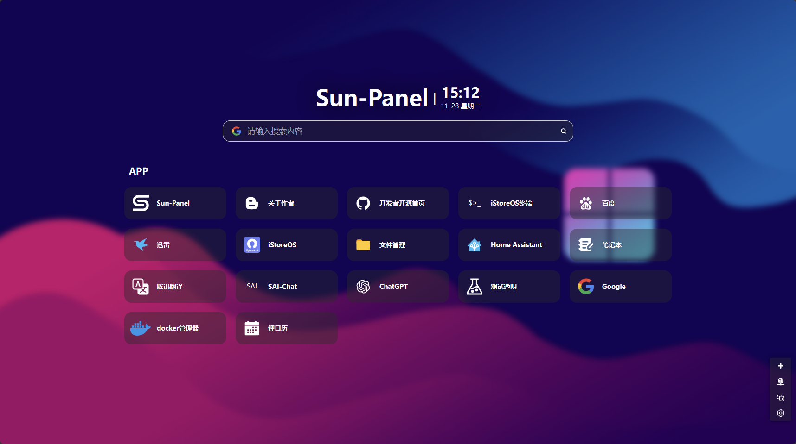

<div align=center>


# Sun-Panel

<a href="https://github.com/hslr-s/sun-panel.git">Github</a> | <a href="https://gitee.com/hslr/sun-panel.git">Gitee</a> | <a href="https://hub.docker.com/r/hslr/sun-panel">Docker Hub</a> |  <a href="https://www.bilibili.com/video/BV1AC4y1U7va">bilibili</a> | <a href="https://www.youtube.com/channel/UCKwbFmKU25R602z6P2fgPYg">YouTube</a>

一个服务器、NAS导航面板、Homepage、浏览器首页。

</div>



## 😎 特点

- 简洁
- 局域网内外网链接切换
- docker部署,对arm系统支持
- 上手简单，免修改代码
- 无需连接外部数据库
- 丰富图标自由搭配（文字图标+svg图标+内置三方图标库）
- 支持网页内置小窗口打开（部分网站屏蔽此功能）
- 占用资源小

## 🎨 演示（demo）

演示站说明：
1. 服务器资源有限请不要上传特大图片文件
2. 方便他人访问，请不要修改主账号密码
3. 数据定期清理，请不要作为主力导航页使用
4. 请不要放违规内容

演示地址：[点此跳转](http://sunpaneldemo.enianteam.com/#/)

账号密码： [默认账号密码](#默认账号密码)
账号：admin@sun.cc 密码：12345678

## 🐳 联系作者&交流群
开发者：**[红烧猎人](https://blog.enianteam.com/u/sun/content/11)**

新建的QQ交流群，进不去可以点上方连接联系作者


## 🍵 打赏

> 开源开发不易，如果觉得我的项目有帮到你，欢迎给我[打赏](./doc/donate.md)或者请我喝个奶茶☕（如果可以备注下您的昵称或者名字），你的支持就是我的动力，谢谢。

|   |   |
| ------------ | ------------ |
|  |   |

## 🫓 后面想做的事

先画个饼

- [x] 分组，拖拽排序
- [x] 导入导出功能
- [x] 增加访客账号
- [x] 帐号解除邮箱限制
- [x] 对上传的文件管理（针对账户增强重复利用，节省空间）
- [ ] 用户自定义搜索框搜索引擎
- [ ] 搜索框样式自定义（背景颜色，文字颜色）
- [ ] 多国语言支持
- [ ] 服务器监控
- [ ] docker管理器
- [ ] 计划任务


## 🖼️ 预览截图

**各种风格，自由搭配**


**内置小窗口**


## 🍜 使用运行教程

<div id="default-username"></div>

### 默认账号密码
账号：admin@sun.cc

密码：12345678

### 命令参数
|参数|说明|
|---|---|
|-h|查看命令说明|
|-config|生成配置文件（conf/conf.ini）|
|-password-reset|重置第一个用户的密码|

### 二进制文件运行

去 [Releases](https://github.com/hslr-s/sun-panel/releases) 下载二进制文件

执行示例

```sh
./sun-panel
```

#### 重置密码

执行示例

```sh
./sun-panel -password-reset
```
输出
```
密码已经重置成功，以下是账号信息
用户名  xxx@qq.com
密码  12345678
```

### docker 运行

目录挂载 `-v`，根据自己的需求选择：
|容器目录|说明|
|---|---|
|/app/conf|配置文件|
|/app/uploads|上传的文件|
|/app/database|数据库文件|
|/app/runtime|运行日志(不推荐挂载)|

1. 拉取镜像
```
docker pull hslr/sun-panel
```

2. 直接下载运行
```
docker run -d --restart=always -p 3002:3002 \
-v ~/docker_data/sun-panel/conf:/app/conf \
-v ~/docker_data/sun-panel/uploads:/app/uploads \
-v ~/docker_data/sun-panel/database:/app/database \
--name sun-panel \
hslr/sun-panel
```


### 自编译运行

#### 前端
```
# 开发运行
pnpm dev

# 编译打包(打包后生成dist目录，若需要结合后端使用请改成web)
pnpm build
```

#### 后端

1.正式编译程序前先进入`service`

2.按照[静态资源编译教程](./service/assets/readme.md)编译后端静态文件

3.正式编译
```
# 进入后端项目
cd service

# 开发运行
go run main.go

# 编译打包
go build -o sun-panel main.go
```

#### docker windows本地开发编译运行

```
// 编译
docker build -t sun-panel .

// 运行 D:\docker\data\sun-panel 为本地运行的路径
docker run --rm -d -p 3003:3002 -v  D:\docker\data\sun-panel\conf:/app/conf -v  D:\docker\data\sun-panel\runtime:/app/runtime -v D:\docker\data\sun-panel\uploads:/app/uploads -v D:\docker\data\sun-panel\database:/app/database --name sun-panel sun-panel
```

## 🎉 图标、壁纸网站推荐

图标：
- [阿里巴巴矢量图标](https://www.iconfont.cn/)
- [Icons8](https://icons8.com/)
- [Vectorjunky](https://www.iconfinder.com/)

壁纸：
- [Wallhaven](https://wallhaven.cc/)
- [Wallpaperscraft](https://wallpaperscraft.com/)
- [Wallpaper Abyss](https://wall.alphacoders.com/)

## ❤️ 感谢

- [Roc](https://github.com/RocCheng)提供自动构建多平台docker镜像[方案](https://github.com/hslr-s/sun-panel/issues/9#issuecomment-1817433439)

## LINCENSE
[MIT](./LICENSE)