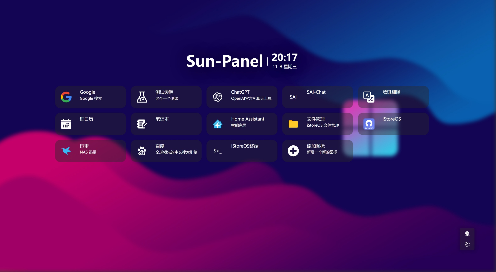
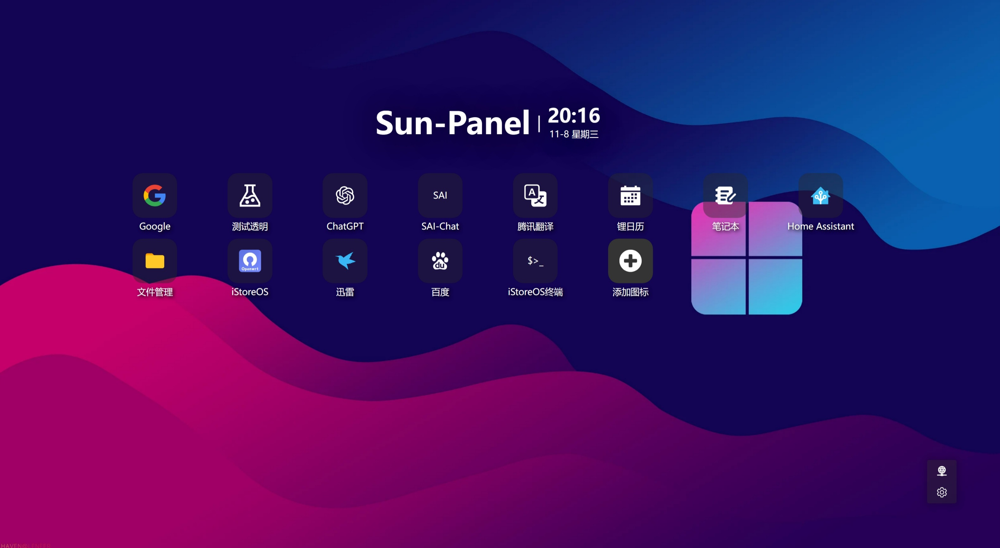
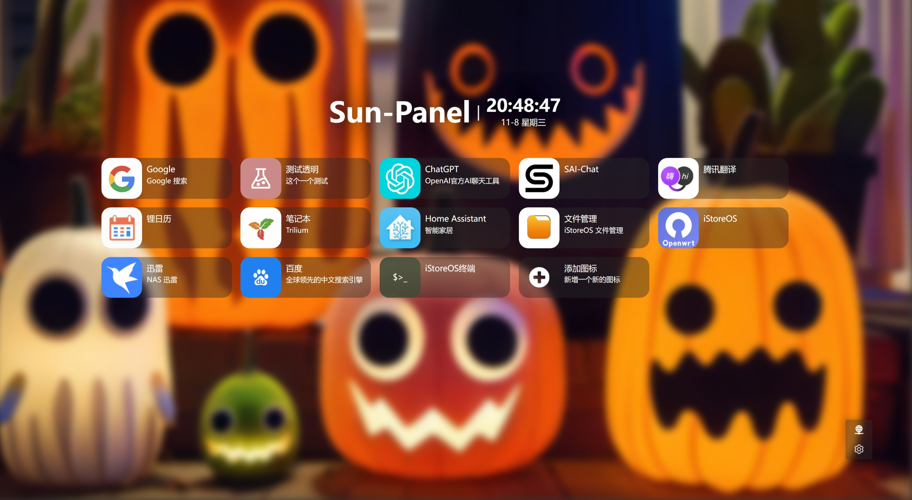
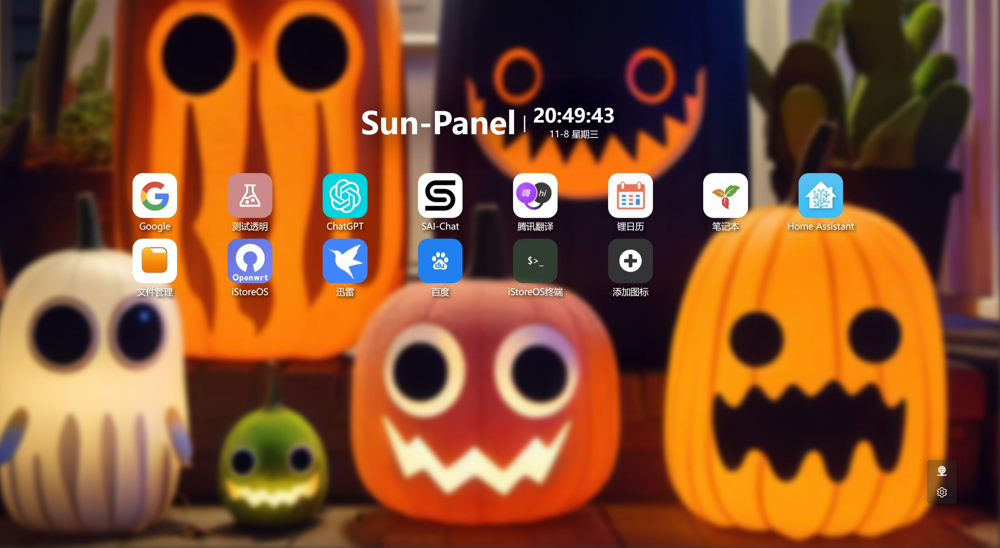
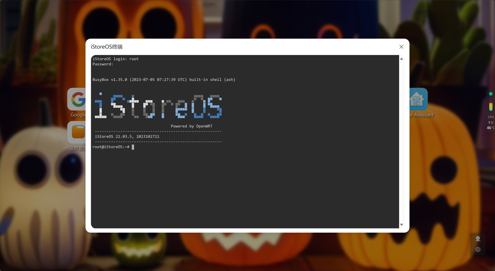
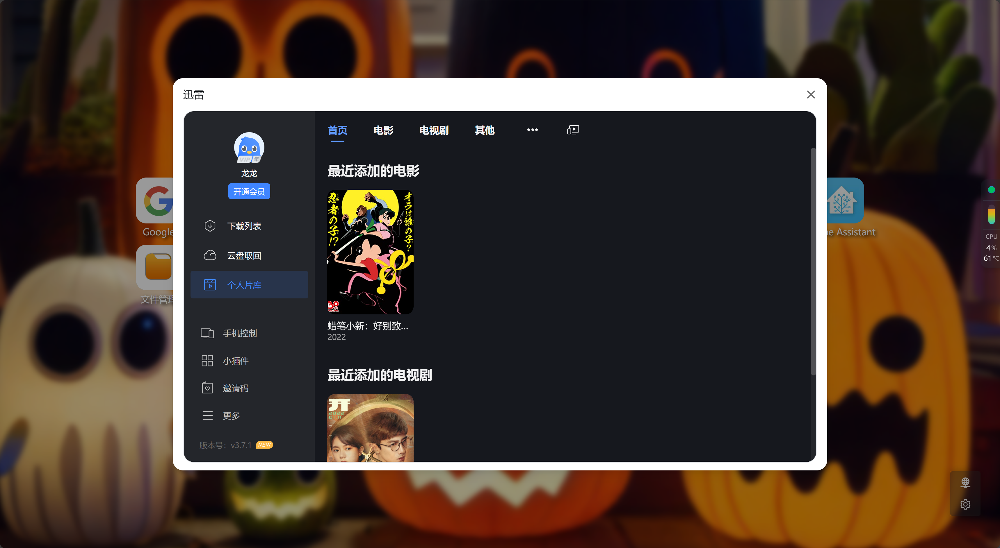

<div align=center>
	
# Sun-Panel
	
<a href="https://github.com/hslr-s/sun-panel.git">Github</a> | <a href="https://gitee.com/hslr/sun-panel.git">Gitee</a>

一个服务器、NAS导航面板、Homepage、浏览器首页。

</div>



## 😎 特点

- 局域网内外网链接切换
- 简洁
- docker 部署
- 上手简单，免修改代码
- 无需连接外部数据库
- 丰富图标自由搭配（文字图标+svg图标+内置三方图标库）
- 支持网页内置小窗口打开（部分网站屏蔽此功能）
- 占用资源小

## 🫓 后面想做的事

先画个饼

- [ ] 图标排序
- [ ] 服务器监控
- [ ] docker管理器
- [ ] 计划任务

## 🖼️ 预览截图





内置小窗口



## 🍜 使用教程

### 默认账号密码
账号：admin@sun.cc

密码：12345678

### 命令参数
|参数|说明|
|---|---|
|-h|查看命令说明|
|-config|生成配置文件（conf/conf.ini）|
|-password-reset|重置第一个用户的密码|

执行示例
```sh
./sun-panel -password-reset
```
输出
```
密码已经重置成功，以下是账号信息
用户名  xxx@qq.com
密码  12345678
```

### docker 运行

目录挂载 `-v`，根据自己的需求选择：
|容器目录|说明|
|---|---|
|/app/conf|配置文件|
|/app/uploads|上传的文件|
|/app/database|数据库文件|
|/app/runtime|运行日志(不推荐挂载)|

1. 拉取镜像
```
docker pull hslr/sun-panel
```

2. 直接下载运行
```
docker run -d --restart=always -p 3002:3002 \
-v ~/docker_data/sun-panel/conf:/app/conf \
-v ~/docker_data/sun-panel/uploads:/app/uploads \
-v ~/docker_data/sun-panel/database:/app/database \
--name sun-panel \
hslr/sun-panel
```


### 编译和运行

前端
```
# 开发运行
pnpm dev

# 编译打包
pnpm build
```

后端
```
# 开发运行

cd service

# 开发运行
go run main.go

# 编译打包
go build -o sun-panel main.go
```

docker windows本地开发编译运行

```
// 编译
docker build -t sun-panel .

// 运行 D:\docker\data\sun-panel 为本地运行的路径
docker run --rm -d -p 3003:3002 -v  D:\docker\data\sun-panel\conf:/app/conf -v  D:\docker\data\sun-panel\runtime:/app/runtime -v D:\docker\data\sun-panel\uploads:/app/uploads -v D:\docker\data\sun-panel\database:/app/database --name sun-panel sun-panel
```
